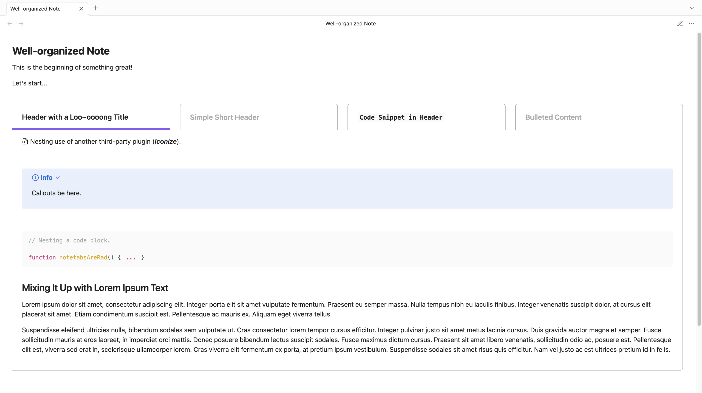
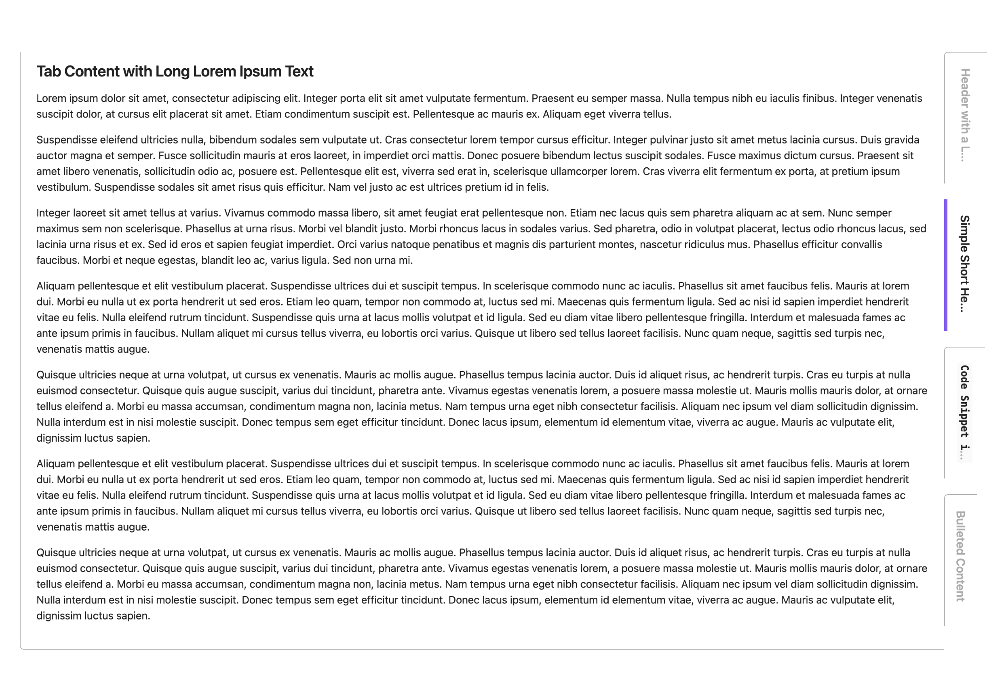

<picture>
 <source media="(width > 800px)" srcset="./docs/assets/notetabs-logo-lockup.svg" type="image/svg+xml" width="75%">
 <source media="(width <= 800px)" srcset="./docs/assets/notetabs-logo-lockup.svg" type="image/svg+xml" width="100%">
 
</picture>
<br><br>

 

Elevate your Obsidian notes with tabbed sections. **Note Tabs** offers an intuitive way to organize your notes with a simple click. **Note Tabs** is highly responsive and compatible with most plugins and themes you choose to use with it.

<br>



<br>

> ##  Getting Started
>
> - [How to Install](#-how-to-install)
>    - [From Obsidian](#from-obsidian)
>    - [Manual Installation](#manual-installation)
> - [How to Use](#-how-to-insert-note-tabs-section)
> - [Core Features](#-core-features)
> - [Support](#-support)
>

<br>
<br>

##  How to Install

### From Obsidian

1. Within the **Community plugins** setting, select **Browse**
2. Search for "**Note Tabs**" from the search bar of the plugin list
3. Select **Note Tabs** (by Project Free Rangers)
4. Install the plugin, then enable

### Manual Installation

1. Download the latest `obsidian-notetabs.zip` from [**Releases**](https://github.com/Project-Free-Rangers/obsidian-notetabs/releases)
2. Extract the zipped folder and copy/paste it to the `.obsidian/plugins` within your desired vault's folder structure
3. Open Obsidian and navigate to **Community plugins**
4. Enable **Note Tabs**

:tada::tada: _Happy organizing!_

<br>

##  How to Insert Note Tabs Section

1. Right-click in the Obsidian editor while in Edit mode
2. Select "**Add new notetabs section**" to insert an entirely new tabbed section, or
3. Select "**Add new notetabs tab**" within an existing tabbed section to add a new tab

| Context Menu Options |
| ------------- |
|  |

**Example of markdown:**

```
~~~notetabs

---begintab
header: New Tab

Replace this with your tab content.
---closetab

~~~
```

<br>

##  Core Features

| Adaptive Tab Headers |
| ------------- |
|  |

<br>

| Vertical Tab Orientation |
| ------------- |
|  |

<br>

| Compact Layout Available |
| ------------- |
|  |

<br>

| Optional Rounded-edges |
| ------------- |
|  |

<br>

| Minimalist Style Available |
| ------------- |
|  |

<br>

##  Support

**Project Free Rangers** is the free-spirited brainchild of me ([Jheanell Elliott](https://github.com/jaemega)). I'm a creative, mentor, and software engineer by trade. When I'm not wrangling large projects at my day job, I like to cobble together nifty side projects that I think are rad and provide them for free.

If you like the fun projects I do and want to say an extra thank you:

<a href='https://ko-fi.com/N4N11RXRQW' target='_blank'></a>

---
---
<br>

> **Credits:**
> - _**Note Tabs** tab logo :copyright: 2026 Jheanell Elliott (Project Free Rangers)_
> - _Icons courtesy of [Lucides](https://lucide.dev/)_